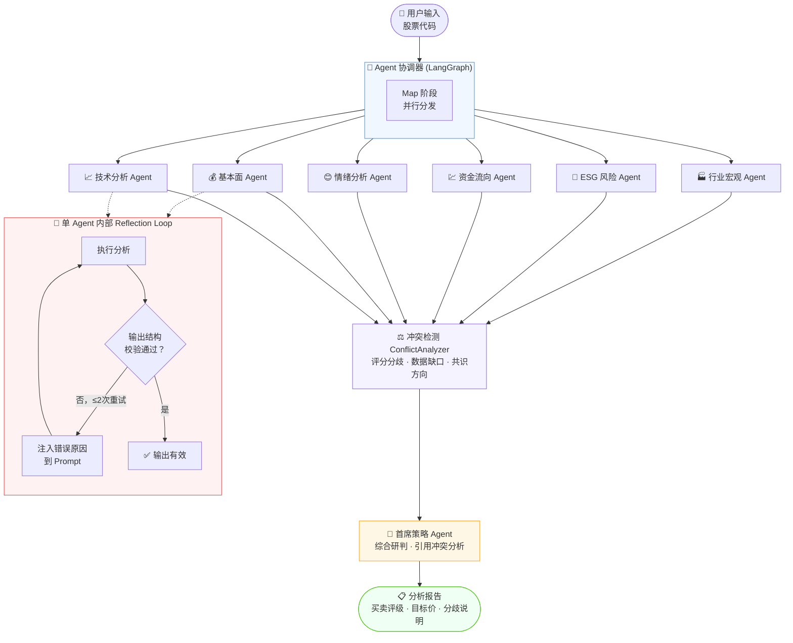
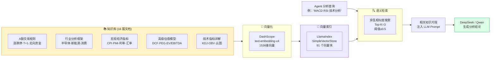
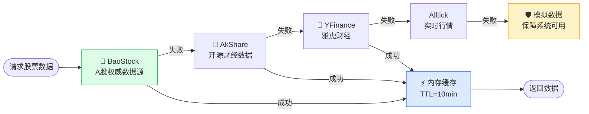
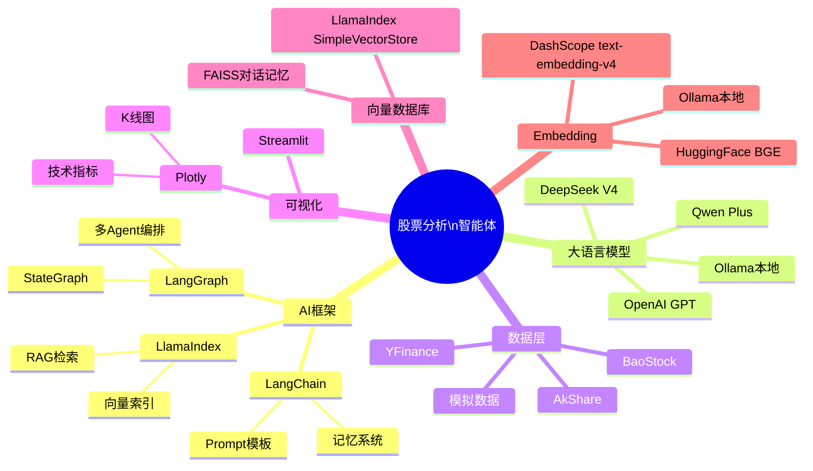

<div align="center">

# 📈 股票分析智能体系统

**基于大语言模型的 A 股多 Agent 智能分析平台**

[](https://python.org)
[](https://streamlit.io)
[](https://github.com/langchain-ai/langgraph)
[](https://www.llamaindex.ai)
[](LICENSE)
[](https://github.com/neopen/stock-analysis-agent)

> 🤖 六个专业 AI Agent 并行协作，内置 **Reflection Loop 自我校验重试**与**跨维度冲突检测**，结合 RAG 知识库，对 A 股进行技术、基本面、情绪、资金流、ESG、行业宏观六大维度的深度分析，由首席策略 Agent 综合研判并输出投资建议。

</div>

---

## ✨ 核心特性

| 特性 | 说明 |
|------|------|
| 🧠 **多 Agent 并行** | LangGraph 编排 7 个专业 Agent，Map-Reduce 模式并行执行 |
| 🔁 **Reflection Loop** | Agent 输出结构校验失败时自动携带错误原因重试（最多 2 次），大幅降低 JSON 解析失败率 |
| ⚖️ **冲突检测** | 独立的 ConflictAnalyzer 节点量化各 Agent 评分分歧、数据缺口，供首席策略参考 |
| 📚 **RAG 知识库** | LlamaIndex + DashScope Embedding，16 篇专业文档精准检索 |
| 📊 **多源数据** | BaoStock 为主，AkShare / YFinance / 模拟数据多级降级 |
| 🎨 **可视化界面** | Streamlit + Plotly 交互式 K 线、技术指标、财务分析图表 |
| 🔌 **多 LLM 支持** | DeepSeek / Qwen / OpenAI / Ollama 一键切换 |
| 💾 **智能缓存** | 10 分钟数据缓存 + 共享 StockDataManager，避免重复 API 调用 |

---

## 🏗️ 系统架构

### 多 Agent 协作流程（含 Reflection Loop）



> **Reflection Loop 说明**：每个专业 Agent 执行后会用 `_validate_output()` 校验输出是否满足最低质量要求（`confidence_score` 是否合理、`key_findings` 是否为空、是否为有效 JSON 等）。若校验失败，错误原因会作为 `Reflection Hint` 注入到下一次 LLM 调用的 Prompt 中，最多重试 2 次，显著降低"LLM 返回不完整 JSON 导致分析降级"的概率。
>
> **ConflictAnalyzer 说明**：所有专业 Agent 完成后，冲突检测节点用纯 Python 逻辑（无需 LLM，执行耗时 <10ms）统一提取各 Agent 的 0-100 评分，检测评分分歧（差距 > 30 分）、数据缺口和失败维度，输出共识方向（偏多/偏空/中性/分歧），供首席策略 Agent 在最终建议中明确说明各维度的分歧和不确定性，避免"虚假共识"。

---

### RAG 知识库检索流程



---

### 数据源降级策略



---

## 🛠️ 技术栈



---

## 🧬 Agent 管理架构演进

项目从最初的"纯并行 Map-Reduce"逐步演进为带自我修正能力的工作流：

| 阶段 | 架构 | 说明 |
|------|------|------|
| v1 | Map-Reduce | 6 个 Agent 并行执行，直接汇总给首席策略，无容错、无重试 |
| v2 | + Bug 修复 | 修复 RAG 检索空片段、Streamlit 单例缓存、评分字段错位、随机数据造假等问题 |
| v3（当前） | **Reflection Loop** | 每个 Agent 内置"执行 → 校验 → 重试"闭环；新增 ConflictAnalyzer 冲突检测节点；差异化超时；共享 `StockDataManager` |

**核心收益：**

- ✅ Agent 输出结构异常时自动重试并携带错误上下文，而非直接降级为默认值
- ✅ 首席策略 Agent 不再"假装各维度一致"，能明确指出评分分歧和数据缺口
- ✅ 各 Agent 差异化超时（基本面 120s / ESG 45s），避免慢 Agent 拖累整体或快 Agent 超时浪费
- ✅ 6 个 Agent 共享一个 `StockDataManager` 实例，避免重复拉取同一股票数据

详见 `hengline/agents/agent_coordinator.py`（`REFLECTION_MAX_RETRIES`、`_create_conflict_analyzer_node`、`_create_agent_node`）与 `test/test_reflection_loop.py`（31 项验收测试）。

---

## 📦 快速开始

### 1. 环境准备

```bash
# 克隆仓库
git clone git@github.com:erli523/stock-analysis-agent.git
cd stock-analysis-agent

# 推荐使用 conda 创建独立环境
conda create -n stock-agent python=3.10
conda activate stock-agent

# 安装依赖
pip install -r requirements.txt
# Windows 用户
pip install -r requirements-windows.txt
```

### 2. 配置 API 密钥

```bash
cp .env.example .env
```

编辑 `.env` 文件，填入你的密钥（至少配置一个 LLM 和 Embedding）：

```ini
# === LLM 配置（选其一）===
DEEPSEEK_API_KEY=sk-xxxx          # 推荐：DeepSeek（性价比最高）
QWEN_API_KEY=sk-xxxx              # 备选：通义千问

# === Embedding 配置（必须）===
EMBEDDING_PROVIDER=openai
EMBEDDING_API_KEY=sk-xxxx         # DashScope Key（支持 text-embedding-v4）
EMBEDDING_BASE_URL=https://dashscope.aliyuncs.com/compatible-mode/v1
EMBEDDING_MODEL=text-embedding-v4

# === 股票数据（可选）===
ALLTICK_TOKEN=xxxx
```

### 3. 构建 RAG 知识库索引

首次使用必须执行（约 1 分钟）：

```bash
python build_rag_index.py
```

知识库文档更新后使用 `--rebuild` 强制重建：

```bash
python build_rag_index.py --rebuild
```

### 4. 启动应用

```bash
# 方式一：批处理脚本（Windows）
start.bat

# 方式二：命令行
python main.py --dashboard

# 方式三：直接启动 Streamlit
streamlit run hengline/streamlit/st_main.py
```

打开浏览器访问 **http://localhost:8501**

---

## 🖥️ 界面预览

应用包含以下视图：

| 视图 | 内容 |
|------|------|
| **Overview** | 股票基本信息（市值、PE、PB、IPO日期）+ 最新新闻 |
| **Price Chart** | 交互式 K 线图（非交易日已过滤）+ 成交量 + 均线 |
| **Technical** | MACD、RSI、布林带等技术指标图 |
| **Financial** | 营收、净利润、ROE、现金流等财务指标 |
| **AI Analysis** | 7 个 Agent 并行分析结果 + 首席策略综合报告 |

---

## 📚 知识库结构

```
knowledge_base/
├── astock/                      # A股专项知识（新增）
│   ├── astock_trading_rules.txt     # 涨跌停·T+1·北向资金·融资融券
│   ├── industry_sector_analysis.txt  # 半导体·新能源·消费·医药·金融
│   ├── macro_market_relationship.txt # CPI·PMI·利率·汇率·政策解读
│   └── valuation_models_advanced.txt # DCF·PEG·EV/EBITDA·DDM
├── basic/                       # 股票基础知识
│   ├── investment_psychology.txt
│   ├── stock_basics.txt
│   ├── stock_risk_management.txt
│   └── stock_trading_strategies.txt
├── stocks/                      # 专业分析方法
│   ├── fundamental_analysis.txt
│   ├── fundamental_analysis_indicators.txt
│   ├── kline_chart_complete_guide.txt
│   ├── stock_advanced_concepts.txt
│   └── technical_indicators_advanced.txt  # KDJ·OBV·VWAP·云图（新增）
└── special/                     # 个股专项分析
    └── jie_jie_micro_300623.txt
```

> 📌 在 `knowledge_base/` 下新增 `.txt` 文档后，运行 `python build_rag_index.py --rebuild` 即可纳入 RAG 检索。

---

## ⚙️ 配置说明

主要配置文件：`config/config.json`

```json
{
  "ai": {
    "provider": "deepseek",
    "model_name": "deepseek-v4-flash",
    "temperature": 0.1,
    "max_tokens": 4000
  },
  "embedding": {
    "provider": "openai",
    "model_name": "text-embedding-v4",
    "enable_memory": true,
    "memory_top_k": 5
  }
}
```

支持的 LLM Provider：`openai` · `deepseek` · `qwen` · `ollama`

支持的 Embedding Provider：`openai`（含兼容接口）· `huggingface` · `ollama`

---

## 🔌 API 调用示例

```python
from api.stock_agent_api import StockAgentAPI

api = StockAgentAPI()

# 单维度分析
result = api.analyze_stock(
    stock_code="300502",
    analysis_type="technical"   # technical / fundamental / comprehensive
)

# 综合分析（触发全部 7 个 Agent）
result = api.analyze_stock(
    stock_code="300502",
    analysis_type="comprehensive",
    time_range="1y"
)

print(result["chief_strategy"]["investment_recommendation"])
```

---

## 📁 项目结构

```
stock-analysis-agent/
├── hengline/
│   ├── agents/          # 7 个专业 Agent + 基类
│   ├── client/          # LLM 客户端（DeepSeek/Qwen/OpenAI/Ollama）
│   ├── rag/             # RAG 链与向量存储管理
│   ├── stock/           # 数据源（BaoStock/AkShare/YFinance 等）
│   ├── streamlit/       # 前端界面（K线/技术/财务/AI分析）
│   ├── tools/           # LlamaIndex 工具、缓存、JSON解析
│   └── prompts/         # 各 Agent 的 YAML 提示词模板
├── knowledge_base/      # RAG 知识库文档（16 篇）
├── data/embeddings/     # 向量索引持久化（自动生成，不提交 git）
├── config/              # 配置文件
├── api/                 # FastAPI 接口
├── test/                # 单元测试（Agent 修复、Reflection Loop 共 60+ 用例）
├── build_rag_index.py   # 知识库索引构建脚本
├── main.py              # 应用入口
└── requirements.txt     # 依赖清单
```

---

## ⚠️ 免责声明

> 本系统的所有分析结果**仅供学习和研究参考**，不构成任何投资建议。股票市场存在风险，投资需谨慎。请投资者根据自身风险承受能力做出独立判断，本项目作者不对任何投资损失负责。

---

## 🙏 致谢

本项目基于 [neopen/stock-analysis-agent](https://github.com/neopen/stock-analysis-agent) 进行二次开发，在原项目基础上做了以下主要改进：

| 改进项 | 说明 |
|--------|------|
| **RAG 链路修复** | 修复向量索引空检测逻辑、`StorageContext` 加载方式及 `Settings.embed_model` 全局注入，使知识库检索真正生效 |
| **知识库扩充** | 新增 5 篇 A 股专项文档（交易规则、行业分析、宏观指标、高级估值、高级技术指标），文档数从 11 → 16，向量块从 65 → 91 |
| **K 线图优化** | 过滤非交易日间隙（`xaxis.type="category"`），修复周末空白问题 |
| **基本信息修复** | 修复 Overview 页面市值、PE(TTM)、PB(MRQ) 不显示的问题，重排 BaoStock API 调用顺序避免 session 污染 |
| **知识库管理 UI** | Streamlit 侧边栏新增知识库状态显示和一键重建索引按钮 |
| **索引构建脚本** | 新增 `build_rag_index.py`，支持 `--rebuild` 参数，方便首次部署和文档更新 |
| **Agent 系统全面体检** | 修复首席策略评分字段错位、Sentiment/ESG/Fundamental 随机数据造假、FundFlow 阈值逻辑错误、子 Agent 失败无 UI 提示等 P0-P2 级问题 |
| **Reflection Loop** | Agent 输出校验失败后自动重试（携带错误上下文），新增 ConflictAnalyzer 冲突检测节点，差异化超时与共享数据管理器 |

感谢原作者 [@neopen](https://github.com/neopen) 提供的优秀项目基础。

---

## 🤝 贡献指南

欢迎提交 Issue 和 Pull Request！

- **新增 Agent**：参考 `hengline/agents/base_agent.py` 实现 `analyze()` 方法
- **新增数据源**：参考 `hengline/stock/sources/` 下任意数据源实现
- **扩充知识库**：在 `knowledge_base/` 下添加 `.txt` 文件，运行 `build_rag_index.py --rebuild`
- **新增 LLM**：参考 `hengline/client/` 添加新的客户端并注册到 `ClientFactory`

---

<div align="center">

**如有问题或建议，欢迎提交 Issue**

⭐ 如果这个项目对你有帮助，请给个 Star！

</div>
