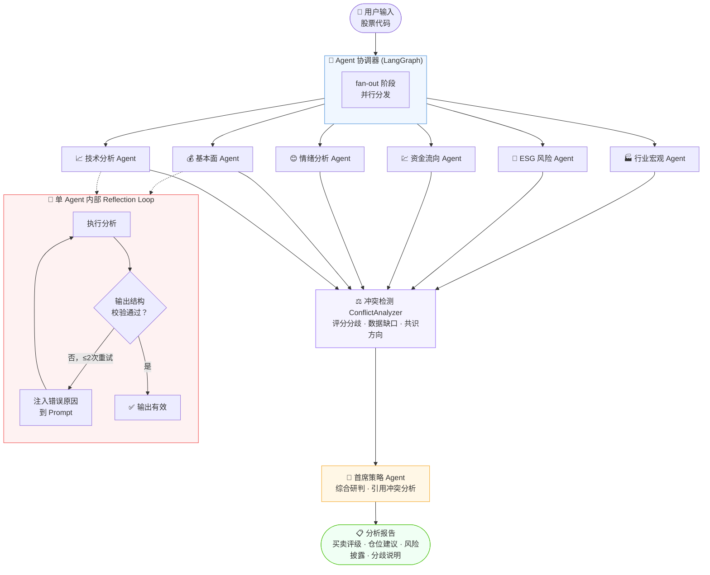
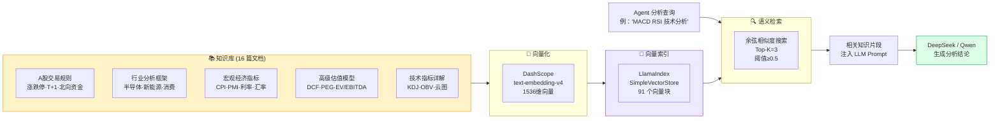
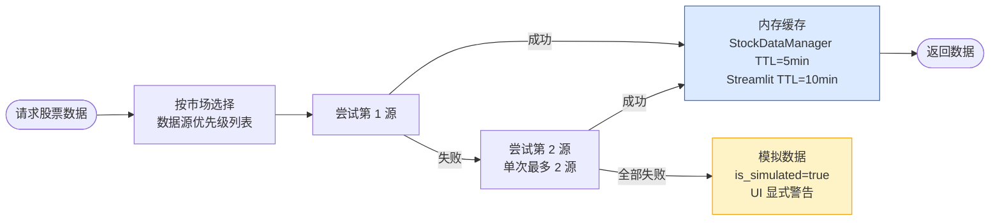
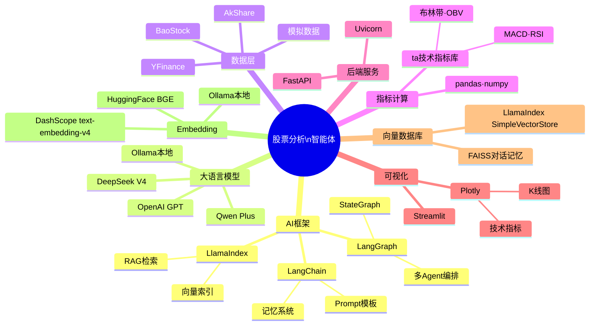

<div align="center">

# 📈 股票分析智能体系统

**基于大语言模型的 A 股多 Agent 智能分析平台**

[](https://python.org)
[](https://streamlit.io)
[](https://github.com/langchain-ai/langgraph)
[](https://www.llamaindex.ai)
[](LICENSE)
[](https://github.com/neopen/stock-analysis-agent)

> 🤖 六个专业 AI Agent 并行协作，内置 **Reflection Loop 自我校验重试**与**跨维度冲突检测**，结合 RAG 知识库，对 A 股进行技术、基本面、情绪、资金流、ESG、行业宏观六大维度的深度分析，由首席策略 Agent 综合研判并输出投资建议。

</div>

---

## ✨ 核心特性

| 特性 | 说明 |
|------|------|
| 🧠 **多 Agent 并行** | LangGraph 编排 6 个专业 Agent + 1 首席策略 Agent，采用 fan-out/fan-in 工作流：专业 Agent 并行执行，ConflictAnalyzer 汇合，再交给首席策略 Agent 综合研判 |
| 🔁 **Reflection Loop** | Agent 输出结构校验失败时自动携带错误原因重试（最多 2 次），并通过图级质量门对失败/缺失/低置信 Agent 触发条件重跑 |
| ⚖️ **冲突检测** | 独立的 ConflictAnalyzer 节点量化各 Agent 评分分歧、数据缺口，供首席策略参考 |
| ⏱️ **差异化超时** | 每个 Agent 独立超时（可用环境变量覆盖），慢维度不拖累整体、快维度不浪费等待 |
| 👑 **加权综合研判** | 首席策略 Agent 按维度权重融合评分，输出 5 档投资建议 + 5 档风险等级 + 仓位与风险缓解建议 |
| 📚 **RAG 知识库** | LlamaIndex + DashScope Embedding，16 篇专业文档精准检索 |
| 📊 **多源数据** | Alltick / BaoStock / JQData 等 9 种数据源，按 A 股/美股优先级自动降级，单次请求最多尝试 2 个源 |
| 🎨 **可视化界面** | Streamlit + Plotly：12 个视图、侧边栏对比/自选/日期范围、K 线/技术/财务图表 |
| 🧭 **产品化工作台** | 自选股、历史分析、知识库问答、筛选/回测/组合/预警、多格式报告导出 |
| 🧪 **按需 Agent** | UI 勾选或 CLI/API `--agents` 指定维度，减少等待和 token 消耗 |
| 🔌 **多 LLM 支持** | DeepSeek / Qwen / OpenAI / Ollama 一键切换 |
| 💾 **智能缓存** | Streamlit 行情缓存 10 分钟 + StockDataManager 内存缓存 5 分钟，Agent 共享取数实例 |
| 🌐 **FastAPI 后端** | REST 接口支持综合分析、单 Agent、多股比较、运行时配置与健康检查 |
| ⌨️ **CLI 工具** | 命令行单次分析、预警批量检查（可接 cron / 任务计划） |

---

## 🏗️ 系统架构

### 多 Agent 协作流程（含 Reflection Loop）



> **Reflection Loop 说明**：每个专业 Agent 执行后会用 `_validate_output()` 校验输出是否满足最低质量要求（`confidence_score` 是否合理、`key_findings` 是否为空、是否为有效 JSON 等）。若校验失败，错误原因会作为 `Reflection Hint` 注入到下一次 LLM 调用的 Prompt 中，最多重试 2 次，显著降低"LLM 返回不完整 JSON 导致分析降级"的概率。
>
> **ConflictAnalyzer 说明**：所有专业 Agent 完成后，冲突检测节点用纯 Python 逻辑（无需 LLM，执行耗时 <10ms）统一提取各 Agent 的 0-100 评分，检测评分分歧（差距 > 30 分）、数据缺口和失败维度，输出共识方向（偏多/偏空/中性/分歧），供首席策略 Agent 在最终建议中明确说明各维度的分歧和不确定性，避免"虚假共识"。

---

### 🧩 Agent 能力矩阵

每个专业 Agent 都遵循统一的分析范式：**取数（共享 `StockDataManager`）→ 确定性指标计算 → RAG 知识检索 → LLM 结构化分析 → 结果校验**。各 Agent 覆盖 6 个分析维度，并向首席策略 Agent 贡献一个可量化的 0-100 评分。

| Agent | 角色 | 6 个分析维度 | 关键数据 / 计算 | 贡献首席的评分字段 | 权重 |
|-------|------|-------------|----------------|-------------------|:----:|
| **FundamentalAgent** | 基本面 | 财务健康 · 盈利 · 成长 · 估值 · 行业可比估值 · 竞争优势 · 管理质量 | 财报 + 估值指标 | `overall_score`（0-10 → 0-100） | **0.25** |
| **TechnicalAgent** | 技术面 | 趋势 · 动量 · 量价 · 波动率 · 形态 · 支撑阻力 | `ta` 库计算 MA50/200、MACD、RSI、布林带、OBV、量比 | `signal_strength` 七档映射 | **0.20** |
| **IndustryMacroAgent** | 行业宏观 | 行业前景 · 宏观经济 · 政策 · 竞争格局 · 行业周期 · 市场趋势 | 行业 ETF 表现 + 宏观环境 | `industry_score` 与 `economic_score` 均值 | **0.15** |
| **SentimentAgent** | 情绪 | 新闻 · 社媒 · 投资者 · 市场 · 情绪趋势 · 事件驱动分析 | 新闻数据 + 事件分类 + 情感词分类 | `news_sentiment` 正向占比 | **0.15** |
| **FundFlowAgent** | 资金流 | 机构持仓 · 大股东变动 · 资金流向 · 量能 · 内部交易 · 外资 | 成交量 + 资金流分类（默认 3 个月） | `flow_classification` 七档映射 | **0.15** |
| **ESGRiskAgent** | ESG 风险 | 环境 · 社会 · 治理 · 争议 · 风险评估 · 可持续 | ESG 维度指标 | `esg_metrics.overall_score` | **0.10** |
| **ChiefStrategyAgent** | 首席策略 | 综合研判 · 风险评估 · 关键因子识别 | 加权融合 + 冲突分析上下文 | 输出最终建议（不参与评分） | — |

**首席策略 Agent 的最终输出：**

- **投资建议（5 档）**：强烈买入 · 买入 · 持有 · 谨慎观望 · 卖出
- **风险等级（5 档）**：低风险 · 中低风险 · 中等风险 · 中高风险 · 高风险
- **综合指标**：加权综合评分 `composite_score`、风险分 `risk_score`、参与维度列表
- **可执行建议**：仓位建议、关键监控指标、风险披露、风险缓解措施、各维度贡献摘要
- **质量护栏**：数据质量等级 `data_quality`、建议降级原因 `guardrail_notes`、短/中/长期限说明 `analysis_horizon`、人工复核 `human_review` 与合规提示
- **仓位与失效边界**：确定性仓位区间 `position_plan`、止损/止盈复核参数、反向风险与结论失效条件 `decision_boundaries`

**⚙️ 工作流执行细节：**

| 机制 | 实现 | 说明 |
|------|------|------|
| **并发控制** | `asyncio.Semaphore(AGENT_LLM_CONCURRENCY)` | 默认最多 3 个 Agent 同时调用 LLM，防止 API 限流；可用环境变量调整 |
| **差异化超时** | `AGENT_TIMEOUTS` | 基本面 120s / 技术 · 行业 90s / 情绪 · 资金流 60s / ESG 45s / 首席 120s，均可用 `*_TIMEOUT` 环境变量覆盖 |
| **评分归一化** | `_compute_agent_score` | 冲突检测节点把 6 个 Agent 的异构输出统一映射到 0-100，用于分歧检测与共识判断 |
| **条件路由 / 按需运行** | `agent_router` + `enabled_agents` / `analysis_focus` / `question` | LangGraph 先进入路由节点，再按显式选择或问题关键词条件分发到相关专业 Agent；UI 勾选和 CLI `--agents` 仍保持兼容 |
| **失败隔离** | `_generate_analysis_report` | 单个 Agent 失败仅跳过该维度并在 UI 标注，不影响其余维度与最终汇总 |
| **拓扑诊断** | `workflow_metadata.topology` | 最终报告返回实际节点、边、reducer 和当前边界，UI 可展开查看 LangGraph 执行链路 |
| **节点轨迹** | `workflow_trace` | 每个专业 Agent、ConflictAnalyzer、ChiefStrategyAgent 完成时写入 trace，便于定位超时、失败和重试次数 |
| **数据质量护栏** | `data_quality_level` / `guardrail_notes` | 模拟、估算、不可用或失败维度会进入冲突检测和首席策略护栏，自动降低建议强度与置信度 |
| **图级质量门** | `agent_quality_gate` | 专业 Agent 并行完成后统一检查缺失、失败、低置信、模拟/不可用数据；可通过条件边回到 router 重跑失败维度 |
| **可选 Checkpoint** | `LANGGRAPH_CHECKPOINTS_ENABLED` / `LANGGRAPH_CHECKPOINT_BACKEND` | 默认关闭；支持 `memory`，也可请求 `sqlite` + `LANGGRAPH_CHECKPOINT_PATH` 持久化，缺少 SQLite saver 依赖时自动回退 MemorySaver |
| **事件流接口** | `/api/analyze/stream` | 基于 LangGraph `astream_events()` 输出标准化节点事件，并通过 FastAPI SSE 返回实时状态 |

**当前 LangGraph 实现边界：**

- 已使用 `StateGraph`、`START`/`END`、`agent_router` 条件路由、并行 fan-out、fan-in 汇合节点，以及 `Annotated` reducer 合并并行状态。
- Reflection Loop 分为两层：单 Agent 节点内保留 prompt 修正重试；图级 `agent_quality_gate` 通过条件边对失败、缺失或低置信 Agent 发起一次可追踪重跑。
- 协调器已提供 LangGraph 事件流接口，FastAPI 暴露 `/api/analyze/stream` SSE；当前 Streamlit UI 默认仍返回最终报告，尚未消费实时 SSE。
- 可通过 `LANGGRAPH_CHECKPOINTS_ENABLED=true` 或 `enable_checkpointing=True` 启用 checkpoint；`LANGGRAPH_CHECKPOINT_BACKEND=sqlite` 会尝试使用 `data/checkpoints/langgraph.sqlite`，当前环境未安装 `langgraph-checkpoint-sqlite` 时会自动降级为内存 checkpoint。

---

### RAG 知识库检索流程



> **双 RAG 链路说明**：项目中有两条独立的 RAG 路径，存储目录不同：
>
> | 用途 | 存储路径 | 触发方式 |
> |------|----------|----------|
> | **Agent 分析增强** | `data/embeddings/` | 每个 Agent 初始化时加载；侧边栏「构建/重建索引」调用 `build_rag_index.py` |
> | **知识库问答页** | `data/knowledge_vector_store/` | 「知识库问答」视图内点击「初始化问答系统」，由 `VectorStoreManager` 从 `knowledge_base/` 构建 |

---

### 数据源降级策略

A 股默认优先级（可在 `hengline/stock/stock_manage.py` 查看）：**Alltick → BaoStock → JQData → AkShare → YFinance → Yahoo Direct → Alpha Vantage**。AkShare / YFinance 等需设置 `{SOURCE}_ENABLED=true` 才会启用；全部失败时使用带 `is_simulated` 标记的模拟数据，UI 会显式警告。



支持的数据源：`Alltick` · `BaoStock` · `JQData` · `AkShare` · `YFinance` · `Yahoo Direct` · `Alpha Vantage` · `IEX Cloud` · `Massive`（美股另有独立优先级）。

---

## 🛠️ 技术栈



---

## 🧬 Agent 管理架构演进

项目从最初的"纯并行 Map-Reduce"逐步演进为带自我修正能力的工作流：

| 阶段 | 架构 | 说明 |
|------|------|------|
| v1 | Map-Reduce | 6 个 Agent 并行执行，直接汇总给首席策略，无容错、无重试 |
| v2 | + Bug 修复 | 修复 RAG 检索空片段、Streamlit 单例缓存、评分字段错位、随机数据造假等问题 |
| v3（当前） | **LangGraph agent_router 条件路由 + fan-out/fan-in + 图级质量门 + Reflection Loop** | `StateGraph` 先由 `agent_router` 根据 `enabled_agents`、`analysis_focus` 或 `question` 选择专业 Agent，再并行分发；`agent_quality_gate` 检查失败/缺失/低置信输出并可条件重跑，ConflictAnalyzer 汇合后交给首席策略 Agent；每个 Agent 仍保留"执行 → 校验 → 重试"闭环 |

**核心收益：**

- ✅ Agent 输出结构异常时自动重试并携带错误上下文，而非直接降级为默认值
- ✅ 首席策略 Agent 不再"假装各维度一致"，能明确指出评分分歧和数据缺口
- ✅ 模拟、估算、不可用或失败维度会触发数据质量护栏，避免在低质量数据下输出过强买入建议
- ✅ 各 Agent 差异化超时（基本面 120s / ESG 45s），避免慢 Agent 拖累整体或快 Agent 超时浪费
- ✅ 6 个 Agent 共享一个 `StockDataManager` 实例，避免重复拉取同一股票数据

详见 `hengline/agents/agent_coordinator.py`（`REFLECTION_MAX_RETRIES`、`QUALITY_GATE_MAX_RETRIES`、`_create_quality_gate_node`、`_create_conflict_analyzer_node`、`get_workflow_topology`、`workflow_trace`）、`hengline/agents/chief_strategy_agent.py`（数据质量评分与建议护栏）与 `test/test_reflection_loop.py`（Reflection、质量门、冲突检测、LangGraph 拓扑验收测试）。

### 代码质量与可维护性

对 Agent 核心与 Streamlit 功能模块做了一轮以「可读性优先」为目标的重构，在不改变行为的前提下拆分长函数、消除重复逻辑：

| 模块 | 重构要点 |
|------|----------|
| `hengline/agents/base_agent.py` | LLM 提示词模板抽取为模块常量（`ANALYSIS_TEMPLATE_WITH_MEMORY/PLAIN`）；`DummyVectorStore`、`Embedding` 适配器提为模块级类；`_generate_analysis`/`_init_memory` 消除内联重复 |
| `hengline/agents/agent_coordinator.py` | `initialize_agents` 改为数据驱动的 Agent 规格表，7 段重复的 `AgentConfig` 收敛为一个循环 |
| `hengline/streamlit/st_main.py` | 页面 CSS 抽取为 `APP_CSS` 常量；`_category_axis` 统一 K线/技术/对比图的交易日压缩逻辑；拆分 `show_financial_export`、`show_agent_analysis`、`show_technical` |
| `hengline/streamlit/st_product_features.py` | 拆分 `render_financial_visuals`（趋势/雷达）与 `render_screener_page`（代码解析/单股筛选） |

重构后全部 **109 项单元测试通过**（`test_agent_fixes` 50 + `test_reflection_loop` 49 + `test_streamlit_product_features` 9 + `test_vector_store` 1），并用 `300502` 在 Streamlit 界面完成概览/技术分析等视图实测验证。

---

## 📋 完整功能清单

以下为当前代码中**已实现并可用**的功能总览（按模块分类）。

### 运行入口

| 方式 | 命令 / 配置 | 说明 |
|------|-------------|------|
| **Streamlit 主界面（默认）** | `python main.py` 或 `start.bat` | 读取 `config.json` 的 `api.port`（默认 **8000**），在同一端口启动 Streamlit |
| **Streamlit 直连** | `streamlit run hengline/streamlit/st_main.py` | 使用 Streamlit 默认端口 **8501** |
| **FastAPI 后端** | `config.json` 设 `"dashboard": false` 后 `python main.py` | 启动 Uvicorn，提供 `/api/*` REST 接口 |
| **CLI 单次分析** | `python main.py analyze 300502 --time-range 1m --agents TechnicalAgent` | 输出 Markdown 报告；可选 `--output result.json` |
| **CLI 预警检查** | `python main.py alerts-check` / `--json` | 读取 `data/user/alerts.json`；有触发时 **exit code 2** |
| **Windows 安装** | `install.bat` | 自动创建虚拟环境并安装依赖 |

### Streamlit 侧边栏（全局）

| 功能 | 说明 |
|------|------|
| 股票代码输入 | 支持 A 股 / 美股代码 |
| 自选股快捷切换 | 从 `data/user/favorites.json` 快速切换 |
| 加入 / 移除自选 | 持久化到本地 JSON |
| 周期选择 | 1D · 1W · 1M · 3M · 6M · 1Y · 5Y · **10Y** · MAX |
| 自定义日期范围 | 勾选后按起止日期过滤行情 |
| **多股对比** | 启用后可输入最多 2 只对比标的，标准化价格曲线（首日=100） |
| 视图切换 | 12 个视图（见下表） |
| 刷新数据缓存 | 清空 `@st.cache_data` 并重新拉取 |
| 知识库状态 | 显示索引是否就绪、文档/chunk 数量 |
| 构建 / 重建索引 | 调用 `build_rag_index.py` 重建 Agent 用向量索引 |

### 12 个主视图

| 视图 | 已实现功能 |
|------|-----------|
| **概览** | 三栏投研工作台、右侧投研状态栏、数据质量 Badge、价格/回撤/量能/估值摘要卡、K 线预览、AI 摘要/风险边界、Basic Information、新闻列表与原文链接、模拟数据警告 |
| **K 线行情** | K 线 + 成交量（非交易日压缩）、市场简报、日收益分布直方图、行情 CSV 导出 |
| **技术分析** | MA5/20/60 均线、技术面解读卡片、技术结论文案、MACD/RSI/布林带高级图表 |
| **财务数据** | 利润表趋势图、财务/估值雷达图、7 类财务表分组展示、逐表 CSV 下载、模拟财务数据警告 |
| **智能体分析** | 按需勾选 Agent 维度、智能体记忆开关、LangGraph 工作流节点条、质量门重试、Agent 状态卡、工作流诊断（共识/分歧/数据缺口）、各 Agent 明细 Tab、结构化首席策略建议、Markdown/HTML/JSON 报告导出、对话式追问 |
| **知识库问答** | 独立 RAG 问答（需手动初始化）、示例问题、检索数量 slider、参考来源展示、问答历史 |
| **自选股** | 列表管理、删除、跳转分析 |
| **历史分析** | 读取 `data/output/{code}/analysis_*.json`、筛选、详情、再次导出报告 |
| **股票筛选** | 候选池输入、PE/PB/涨跌幅/MA20 条件、进度条、结果表格 |
| **策略回测** | 可调短/长均线、含手续费/滑点的收益曲线、买入持有基准、最大回撤、夏普比率、胜率、交易次数与回测假设 |
| **投资组合** | 本地持仓录入（含备注）、删除、组合总市值/浮动盈亏汇总 |
| **预警配置** | 价格上下限、启用/禁用、手动检查触发状态 |

### Agent 智能分析

| 功能 | 说明 |
|------|------|
| 6 专业 + 1 首席 Agent | 见上文「Agent 能力矩阵」 |
| Reflection Loop | 节点内输出校验失败自动重试（≤2 次），错误注入 Prompt；图级质量门可对失败/缺失/低置信 Agent 条件重跑 |
| ConflictAnalyzer | 纯 Python 评分分歧/数据缺口/共识检测 |
| 行业可比估值 | 基本面 Agent 输出 PE/PB/PS 行业参考区间、估值分档与估值风险 |
| 事件驱动分析 | 情绪 Agent 对业绩、分红回购、股东变动、监管、业务与政策事件做分类和严重度标记 |
| 按需运行 | UI multiselect、CLI/API `enabled_agents`，或 API `analysis_focus` / `question` 自动路由 |
| 智能体记忆 | 可选 FAISS VectorStoreRetrieverMemory（`enable_memory`） |
| 共享取数 | 7 个 Agent 注入同一 `StockDataManager` |
| 并发 / 超时 | `AGENT_LLM_CONCURRENCY` + 各 Agent 独立 `*_TIMEOUT` |
| 结果持久化 | 自动保存到 `data/output/{code}/analysis_{code}_{timestamp}.json` |

### FastAPI REST 接口（前缀 `/api`）

设置 `APP_API_KEY` 后需携带 `X-API-Key` 或 `Authorization: Bearer` 头（Swagger `/docs` 除外）。

| 方法 | 路径 | 功能 |
|------|------|------|
| `POST` | `/api/analyze` | 完整 LangGraph 综合分析，支持 `agent_params` / `chief_params` |
| `POST` | `/api/analyze/agent` | 单 Agent 分析（`execute_single_agent`） |
| `POST` | `/api/compare` | 多股批量分析并按建议/评分比较 |
| `GET` | `/api/agents` | 获取已初始化 Agent 列表与状态 |
| `POST` | `/api/agent/config` | 运行时更新 Agent 配置（模型/记忆等） |
| `GET` | `/api/health` | 健康检查 |
| `GET` | `/api/api` | 重定向到 Swagger 文档 |

### 本地数据持久化

| 路径 | 内容 |
|------|------|
| `data/user/favorites.json` | 自选股列表 |
| `data/user/portfolio.json` | 投资组合持仓 |
| `data/user/alerts.json` | 价格预警规则 |
| `data/output/{code}/` | AI 分析历史 JSON |
| `data/embeddings/` | Agent RAG 向量索引 |
| `data/knowledge_vector_store/` | 知识库问答向量索引 |
| `data/visualizations/` | 可视化输出目录（API 启动时自动创建） |

---

## 📦 快速开始

### 1. 环境准备

```bash
# 克隆仓库
git clone git@github.com:erli523/stock-analysis-agent.git
cd stock-analysis-agent

# 推荐使用 conda 创建独立环境
conda create -n stock-agent python=3.10
conda activate stock-agent

# 安装依赖
pip install -r requirements.txt
# Windows 用户也可运行
install.bat
```

### 2. 配置 API 密钥

```bash
cp .env.example .env
```

编辑 `.env` 文件，填入你的密钥（至少配置一个 LLM 和 Embedding）：

```ini
# === LLM 配置（选其一）===
DEEPSEEK_API_KEY=sk-xxxx          # 推荐：DeepSeek（性价比最高）
QWEN_API_KEY=sk-xxxx              # 备选：通义千问

# === Embedding 配置（必须）===
EMBEDDING_PROVIDER=openai
EMBEDDING_API_KEY=sk-xxxx         # DashScope Key（支持 text-embedding-v4）
EMBEDDING_BASE_URL=https://dashscope.aliyuncs.com/compatible-mode/v1
EMBEDDING_MODEL=text-embedding-v4

# === 股票数据（可选）===
ALLTICK_API_KEY=xxxx              # 配置后 Alltick 在 A 股优先级中排第一
AKSHARE_ENABLED=false             # 设为 true 启用 AkShare
YFINANCE_ENABLED=false            # 设为 true 启用 YFinance

# === 性能调优（可选）===
AGENT_LLM_CONCURRENCY=3           # 同时进行的 Agent LLM 调用上限
FUNDAMENTAL_TIMEOUT=120           # 各 Agent 超时（秒），均可覆盖
TECHNICAL_TIMEOUT=90
INDUSTRY_TIMEOUT=90
SENTIMENT_TIMEOUT=60
FUNDFLOW_TIMEOUT=60
ESG_TIMEOUT=45
CHIEF_TIMEOUT=120

# === API 服务（可选）===
APP_API_KEY=                      # 设置后 FastAPI 启用鉴权
APP_CORS=1                        # 启用 CORS
PORT=8000                         # 覆盖 config.json 端口
```

### 3. 构建 RAG 知识库索引

首次使用必须执行（约 1 分钟）：

```bash
python build_rag_index.py
```

知识库文档更新后使用 `--rebuild` 强制重建：

```bash
python build_rag_index.py --rebuild
```

### 4. 启动应用

```bash
# 方式一：批处理脚本（Windows，默认端口 8000）
start.bat

# 方式二：命令行（默认启动 Streamlit，端口读 config.json，默认 8000）
python main.py

# 方式三：显式指定 Streamlit
python main.py --dashboard

# 方式四：直接启动 Streamlit（默认端口 8501）
streamlit run hengline/streamlit/st_main.py

# 方式五：仅启动 FastAPI 后端（需在 config.json 的 api 节设 "dashboard": false）
python main.py

# CLI 单次分析
python main.py analyze 300502 --time-range 1m --agents TechnicalAgent FundamentalAgent
python main.py analyze 300502 --output result.json

# CLI 预警检查（可接 Windows 任务计划 / cron）
python main.py alerts-check
python main.py alerts-check --json
```

打开浏览器：

- `python main.py` → **http://localhost:8000**（默认，可在 `config.json` 或 `PORT` 环境变量修改）
- `streamlit run ...` → **http://localhost:8501**

---

## 🖥️ 界面预览

主界面为 Streamlit 工作台，包含 **12 个视图** 和 **全局侧边栏**（自选、周期、对比、缓存、知识库索引）。完整功能说明见上文 [📋 完整功能清单](#-完整功能清单)。

| 视图 | 一句话说明 |
|------|-----------|
| 概览 | 基本信息 + 市场快照 + K 线预览 + 新闻 |
| K 线行情 | 交互式 K 线/成交量 + 行情解读 + CSV 导出 |
| 技术分析 | 均线 + MACD/RSI/布林带 + 技术面结论 |
| 财务数据 | 趋势图/雷达图 + 分组财务表 + CSV |
| 智能体分析 | 多 Agent 工作流 + 诊断 + 报告 + 追问 |
| 知识库问答 | 独立 RAG 投资知识问答 |
| 自选股 / 历史分析 | 本地持久化管理 |
| 股票筛选 / 策略回测 | 量化辅助工具 |
| 投资组合 / 预警配置 | 本地持仓与价格阈值 |

---

## 📚 知识库结构

```
knowledge_base/                  # 16 篇 .txt 文档
├── astock/                      # A股专项
│   ├── astock_trading_rules.txt
│   ├── industry_sector_analysis.txt
│   ├── macro_market_relationship.txt
│   └── valuation_models_advanced.txt
├── basic/                       # 基础知识
│   ├── investment_psychology.txt
│   ├── stock_basics.txt
│   ├── stock_risk_management.txt
│   ├── stock_trading_strategies.txt
│   └── technical_analysis.txt
├── stocks/                      # 分析方法
│   ├── fundamental_analysis.txt
│   ├── fundamental_analysis_indicators.txt
│   ├── kline_chart_complete_guide.txt
│   ├── stock_advanced_concepts.txt
│   └── technical_indicators_advanced.txt
├── special/                     # 个股专项
│   └── jie_jie_micro_300623.txt
└── self/                        # Agent 自身说明
    └── ai_agent_self.txt
```

> 📌 在 `knowledge_base/` 下新增 `.txt` 文档后，运行 `python build_rag_index.py --rebuild` 即可纳入 RAG 检索。

---

## ⚙️ 配置说明

主要配置文件：`config/config.json`

```json
{
  "llm": {
    "provider": "deepseek",
    "model_name": "deepseek-v4-flash",
    "temperature": 0.1,
    "max_tokens": 4000
  },
  "embedding": {
    "provider": "openai",
    "model_name": "text-embedding-v4",
    "enable_memory": true,
    "memory_top_k": 5
  },
  "api": {
    "host": "0.0.0.0",
    "port": 8000,
    "dashboard": true
  }
}
```

> `api.dashboard`：`true`（默认）启动 Streamlit；`false` 启动 FastAPI。也可通过 `python main.py --dashboard` 强制 Streamlit。

支持的 LLM Provider：`openai` · `deepseek` · `qwen` · `ollama`

支持的 Embedding Provider：`openai`（含兼容接口）· `huggingface` · `ollama`

### API Key 鉴权

默认本地开发不启用 API 鉴权。设置 `APP_API_KEY` 后，FastAPI 端点会要求请求携带以下任一头：

```bash
X-API-Key: your-key
Authorization: Bearer your-key
```

Swagger 文档 `/docs`、`/redoc`、`/openapi.json` 保持可访问，方便调试。

**调用示例：**

```bash
curl -X POST http://localhost:8000/api/analyze \
  -H "Content-Type: application/json" \
  -H "X-API-Key: your-key" \
  -d '{"stock_code": "300502", "time_range": "1m"}'
```

---

## 🧪 测试

推荐在 `stock-agent` conda 环境下运行：

```bash
conda activate stock-agent

# Agent 修复 + Reflection Loop / 质量门 / 冲突分析（50 + 49 用例）
python -m pytest test/test_agent_fixes.py test/test_reflection_loop.py -q

# 产品功能 helper 测试（7 用例）
python -m pytest test/test_streamlit_product_features.py -q

# 向量存储测试（1 用例，需 llama_index 环境）
python -m pytest test/test_vector_store.py -q

# 当前核心回归套件（109 用例）
python -m pytest test/test_agent_fixes.py test/test_reflection_loop.py test/test_streamlit_product_features.py test/test_vector_store.py -q

# 关键文件语法检查
python -m py_compile main.py app/application.py hengline/streamlit/st_main.py hengline/streamlit/st_product_features.py hengline/agents/agent_coordinator.py hengline/agents/base_agent.py
```

---

## 📁 项目结构

```
stock-analysis-agent/
├── hengline/
│   ├── agents/          # 6 专业 Agent + 首席 + LangGraph 协调器 + 基类
│   ├── client/          # LLM / Embedding 客户端（DeepSeek/Qwen/OpenAI/Ollama）
│   ├── rag/             # RAG 链与 VectorStoreManager（知识库问答用）
│   ├── stock/           # StockDataManager + 9 种数据源实现
│   ├── streamlit/       # 主 UI（st_main / st_product_features / st_qa 等）
│   ├── tools/           # LlamaIndex 工具、缓存、JSON 解析
│   ├── prompts/         # 各 Agent 的 YAML 提示词模板
│   └── example/         # Agent / API 示例脚本
├── knowledge_base/      # RAG 知识库文档（16 篇）
├── data/
│   ├── embeddings/      # Agent RAG 向量索引
│   ├── knowledge_vector_store/  # 知识库问答向量索引
│   ├── output/          # AI 分析历史 JSON
│   ├── user/            # favorites / portfolio / alerts
│   └── visualizations/  # 可视化输出
├── config/              # config.json 与环境变量映射
├── app/                 # FastAPI 应用入口（application.py）
├── api/                 # REST 路由（/api/analyze 等）
├── test/                # 单元测试（核心回归 109 用例）
├── build_rag_index.py   # Agent 知识库索引构建
├── install.bat          # Windows 安装脚本
├── start.bat            # Windows 启动脚本
├── main.py              # 统一入口（Streamlit / FastAPI / CLI）
└── requirements.txt
```

---

## ⚠️ 免责声明

> 本系统的所有分析结果**仅供学习和研究参考**，不构成任何投资建议。股票市场存在风险，投资需谨慎。请投资者根据自身风险承受能力做出独立判断，本项目作者不对任何投资损失负责。

---

## 🙏 致谢

本项目基于 [neopen/stock-analysis-agent](https://github.com/neopen/stock-analysis-agent) 进行二次开发，在原项目基础上做了以下主要改进：

| 改进项 | 说明 |
|--------|------|
| **RAG 链路修复** | 修复向量索引空检测逻辑、`StorageContext` 加载方式及 `Settings.embed_model` 全局注入，使知识库检索真正生效 |
| **知识库扩充** | 新增 5 篇 A 股专项文档（交易规则、行业分析、宏观指标、高级估值、高级技术指标），文档数从 11 → 16，向量块从 65 → 91 |
| **K 线图优化** | 过滤非交易日间隙（`xaxis.type="category"`），修复周末空白问题 |
| **基本信息修复** | 修复 Overview 页面市值、PE(TTM)、PB(MRQ) 不显示的问题，重排 BaoStock API 调用顺序避免 session 污染 |
| **知识库管理 UI** | Streamlit 侧边栏新增知识库状态显示和一键重建索引按钮 |
| **产品功能接入** | 主界面新增知识库问答、自选股、历史分析、AI 报告导出、按维度选择 Agent |
| **图表能力补齐** | 技术页新增 MACD/RSI/布林带，财务页新增趋势图和雷达图 |
| **工具型能力** | 新增日期范围、股票筛选、均线回测、组合管理、价格预警、CLI 分析入口 |
| **API 安全** | 设置 `APP_API_KEY` 后启用 API Key 鉴权，兼容 `X-API-Key` 和 Bearer Token |
| **索引构建脚本** | 新增 `build_rag_index.py`，支持 `--rebuild` 参数，方便首次部署和文档更新 |
| **Agent 系统全面体检** | 修复首席策略评分字段错位、Sentiment/ESG/Fundamental 随机数据造假、FundFlow 阈值逻辑错误、子 Agent 失败无 UI 提示等 P0-P2 级问题 |
| **Reflection Loop** | Agent 输出校验失败后自动重试（携带错误上下文），新增 ConflictAnalyzer 冲突检测节点，差异化超时与共享数据管理器 |

感谢原作者 [@neopen](https://github.com/neopen) 提供的优秀项目基础。

---

## 🤝 贡献指南

欢迎提交 Issue 和 Pull Request！

- **新增 Agent**：参考 `hengline/agents/base_agent.py` 实现 `analyze()` 方法
- **新增数据源**：参考 `hengline/stock/sources/` 下任意数据源实现
- **扩充知识库**：在 `knowledge_base/` 下添加 `.txt` 文件，运行 `build_rag_index.py --rebuild`
- **新增 LLM**：参考 `hengline/client/` 添加新的客户端并注册到 `ClientFactory`

---

<div align="center">

**如有问题或建议，欢迎提交 Issue**

⭐ 如果这个项目对你有帮助，请给个 Star！

</div>
